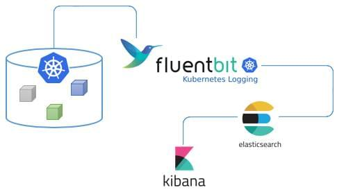
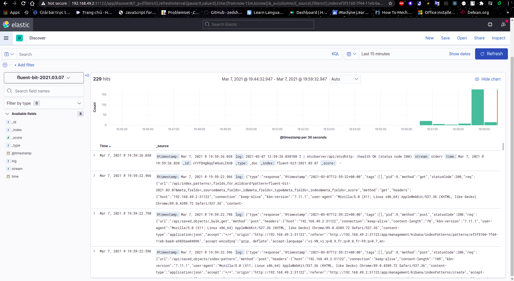

# **[EFK stack on K8S](https://ductn.info/EFK-stack-on-Kubernetes)**

## **Giới thiệu**

  Một hệ thống có thể  chạy nhiều dịch vụ hoặc ứng dụng khác nhau, vì vậy việc
theo dõi hệ thống là vô cùng cần thiết. **Logging** là một công cụ đơn giản nhưng
lại rất tiện lợi giúp ghi lại toàn bộ hoạt động của hệ thống. Nhờ có *logging*, 
ta có thể  tra cứu lại trạng thái của hệ thống trong quá khứ và có thể  tìm và 
fix lại lỗi dễ dàng hơn.

  Hiện nay đã có khá nhiều công cụ để  quản lý log khác nhau. Trong bài viết này,
mình sẽ đề  cập đến bộ công cụ EFK(Elasticsearch-Fluentbit-Kibana). EFK có rất nhiều
ưu điểm như phần mềm mã nguồn mở hoàn toàn miễn phí 😁😁😁 và rất dễ  xài nữa.
Bây giờ, mình sẽ giới thiệu cho anh em bộ công cụ này và mình dùng để  demo theo 
dõi log của cụm kubernetes. *OK!!! Vào thôi*.

  EFK stack là tập hợp của 3 phần mềm đi chung với nhau bao gồm:
  
  * **Elasticsearch**: Cơ sở dữ liệu *NoSQL* dùng để  lưu trữ dữ liệu và cung cấp
  interface để  tìm kiếm và query log.
  * **Fluent-bit**: Là phần mềm mã nguồn mở, viết bằng **C**, được thiết kế  nhằm
  chú trọng đến hiệu suất. Nó cho phép bạn thu thập logs từ nhiều nguồn khác nhau.
  *Fluent bit* được phát triển bởi *Fluentd team* với mục đích tạo ra một phiên
  bản *lightweight* trong việc xử  lý logs. Sau đó, *fluent bit* được sử dụng như
  một giải pháp xử lý dành cho *Cloud*.
  * **Kibana**: Giao diện để  quản lý, thống kê logs. Có nhiệm vụ đọc thông tin
  từ *elasticsearch*.

  Cơ chế  hoạt động của bộ công cụ được mô tả qua hình dưới đây:

  <p align="center">
    
  </p>

  1. Đầu tiên, log sẽ được đưa đến Fluent-bit.
  2. Fluent-bit sẽ đọc những log này, thêm những thông tin như thời gian, IP,
  parse dữ liệu từ log (server nào, độ nghiêm trọng, nội dung log) và ghi xuống
  Elasticsearch.
  3. Để xem log, chúng ta truy cập URL của Kibana. Kibana sẽ đọc thông tin log
  trong Elasticsearch, hiển thị lên giao diện cho người dùng query và xử lý.

  Bây giờ, mình sẽ "đề  mô" EFK stack cho Kubernetes

## **Demo**

  Ở bài viết này, mình sử  dụng **minikube** để  deploy cụm kubernetes, vì vậy
  anh em nào chưa cài minikube thì cài nha 😁😁😁. Để  cài thì anh em cứ vô trang
  chủ xem thôi, cũng đơn giản thôi. Anh em sẽ phải cài hai thứ là **minikube** và
  set up **kubectl** cho **minikube**, mình để  link cài ở [đây](https://minikube.sigs.k8s.io/docs/start/)
  cho ai lười tìm :v.

  Mình sẽ demo theo thứ tự sau *Elasticsearch - Kibana - Fluent bit*. Source code
  mình sẽ để  ở [đây](https://github.com/ductnn/demo-EFK) cho anh em tiện theo
  dõi.

  **Bước 1**: Start cụm minikube

```sh
ductn@ductn:~/demo-EFK$ minikube start
😄  minikube v1.17.1 on Ubuntu 18.04
🎉  minikube 1.18.1 is available! Download it: https://github.com/kubernetes/minikube/releases/tag/v1.18.1
💡  To disable this notice, run: 'minikube config set WantUpdateNotification false'
✨  Automatically selected the docker driver
👍  Starting control plane node minikube in cluster minikube
🔥  Creating docker container (CPUs=2, Memory=2200MB) ...
🐳  Preparing Kubernetes v1.20.2 on Docker 20.10.2 ...
    ▪ Generating certificates and keys ...
    ▪ Booting up control plane ...
    ▪ Configuring RBAC rules ...
🔎  Verifying Kubernetes components...
🌟  Enabled addons: storage-provisioner, default-storageclass
🏄  Done! kubectl is now configured to use "minikube" cluster and "default" namespace by default
```

  **Bước 2**: Tạo namespace chung cho cụm kubernetes

```sh
ductn@ductn:~/demo-EFK$ kubectl create -f https://raw.githubusercontent.com/ductnn/demo-EFK/main/kube-logging.yaml
namespace/kube-logging created
```

Kiểm tra

```sh
ductn@ductn:~/demo-EFK$ kubectl get ns
NAME              STATUS   AGE
default           Active   2m24s
kube-logging      Active   15s
kube-node-lease   Active   2m25s
kube-public       Active   2m25s
kube-system       Active   2m25s
```

  Ta thấy namespace `kube-logging` chung đã được tạo

  **Bước 3**: Deploy Elasticsearch. Ở bước này chung ta sẽ deploy 2 phần, đầu
  tiên là `service` và `statefuleset` của elasticsearch. Ở trong `serivices`
  mình sử dụng `type: NodePort` để  dễ  dàng chọc vô kiểm tra, nhưng cách này
  chỉ phục vụ demo cho dễ  thôi chứ không an toàn vì ai lại đi choc vô DB tùy tiện
  nhỷ 😸💀👻.

```sh
ductn@ductn:~/demo-EFK$ kubectl create -f https://raw.githubusercontent.com/ductnn/demo-EFK/main/elastic-service.yaml
service/elasticsearch created
ductn@ductn:~/demo-EFK$ kubectl create -f https://raw.githubusercontent.com/ductnn/demo-EFK/main/elastic-statefulset.yaml
statefulset.apps/elasticsearch created
```

Kiểm tra

```sh
ductn@ductn:~/demo-EFK$ kubectl get svc -n kube-logging
NAME            TYPE       CLUSTER-IP       EXTERNAL-IP   PORT(S)          AGE
elasticsearch   NodePort   10.101.126.180   <none>        9200:31544/TCP   54s
ductn@ductn:~/demo-EFK$ kubectl get pods -n kube-logging
NAME              READY   STATUS    RESTARTS   AGE
elasticsearch-0   1/1     Running   0          84s
```

  **Bước 4**: Deploy Kibana, mình cũng sẽ deploy giống thằng elasticsearch,
  `services` vẫn sẽ để  `type: NodePort` để  tiện demo.

```sh
ductn@ductn:~/demo-EFK$ kubectl create -f https://raw.githubusercontent.com/ductnn/demo-EFK/main/kibana.yml
service/kibana created
deployment.apps/kibana created
```

Kiểm tra

```sh
ductn@ductn:~/demo-EFK$ kubectl get svc -n kube-logging
NAME            TYPE       CLUSTER-IP       EXTERNAL-IP   PORT(S)          AGE
elasticsearch   NodePort   10.101.126.180   <none>        9200:31544/TCP   6m56s
kibana          NodePort   10.103.245.24    <none>        5601:31122/TCP   37s
ductn@ductn:~/demo-EFK$ kubectl get pods -n kube-logging
NAME                      READY   STATUS    RESTARTS   AGE
elasticsearch-0           1/1     Running   0          7m16s
kibana-5d6849dc8c-kmf7l   1/1     Running   0          82s
```

  Sau đây là phần quan trọng nhất, deploy bé **Fluent-bit**. Mình sẽ giải thích
  kỹ qua các bước deploy.

  Đầu tiên, để  thu thập logs từ cụm kubernetes, mình sẽ phải cấp cho fluent-bit
  một account và một số  quyền như `["get", "list", "watch"]` để  có thể  quản lý
  logs.

```sh
ductn@ductn:~/demo-EFK$ kubectl create -f https://raw.githubusercontent.com/ductnn/demo-EFK/main/fluent-bit-service-account.yml
serviceaccount/fluent-bit created
ductn@ductn:~/demo-EFK$ kubectl create -f https://raw.githubusercontent.com/ductnn/demo-EFK/main/fluent-bit-role.yml
Warning: rbac.authorization.k8s.io/v1beta1 ClusterRole is deprecated in v1.17+, unavailable in v1.22+; use rbac.authorization.k8s.io/v1 ClusterRole
clusterrole.rbac.authorization.k8s.io/fluent-bit-read created
```

  OK!!! Sau đó, ta cần liên kết `ServiceAccount` với `ClusterRole` vừa tạo ở trên

```sh
ductn@ductn:~/demo-EFK$ kubectl create -f https://raw.githubusercontent.com/ductnn/demo-EFK/main/fluent-bit-role-binding.yml
Warning: rbac.authorization.k8s.io/v1beta1 ClusterRoleBinding is deprecated in v1.17+, unavailable in v1.22+; use rbac.authorization.k8s.io/v1 ClusterRoleBinding
clusterrolebinding.rbac.authorization.k8s.io/fluent-bit-read created
```

  Tiếp theo, mình tiến hành deploy file `ConfigMap` của fluent-bit. Anh em có thể
  theo dõi file `ConfigMap` của mình ở [đây](https://github.com/ductnn/demo-EFK/blob/main/fluent-bit-configmap.yml).
  Ở đây, mình sử  dụng 4 sections của fluent-bit:

  1. [SERVICE] dùng để  tạo file logs.
  2. [INPUT] cấu hình đầu vào của nơi lấy logs. Phần lấy logs mình lấy tại thư mục
  `/var/log/containers/*.log` trong cụm minikube. Anh em có thể  cấu hình file
  log mà mình muốn lấy (Ví dụ: etcd, kube-api, ...).
  3. [OUTPUT] cấu hình đầu ra file log là `host` và `port` của elasticsearch.
  4. [PARSER] cấu hình file logs dạng `json` và time,...

   Anh em có thể  tìm hiểu thêm trên docs của fluent-bit nhá. Mình cấu hình sương
   sương vậy, demo tiếp thôi :3

```sh
ductn@ductn:~/demo-EFK$ kubectl create -f https://raw.githubusercontent.com/ductnn/demo-EFK/main/fluent-bit-configmap.yml
configmap/fluent-bit-config created
```

  Cuối cùng là deploy file `DaemonSet` của fluent-bit. Nhưng trước đó, anh em quay
  lại chỗ  của elasticsearch để  lấy `IP` và cấu hình vào file `DaemonSet` của
  fluent-bit như sau:

Lấy IP của elasticsearch

```sh
ductn@ductn:~/demo-EFK$ kubectl get svc -n kube-logging
NAME            TYPE       CLUSTER-IP       EXTERNAL-IP   PORT(S)          AGE
elasticsearch   NodePort   10.101.126.180   <none>        9200:31544/TCP   50m
```

Cấu hình vào fluent-bit:

```yml
env:
- name: FLUENT_ELASTICSEARCH_HOST
    value: "10.101.126.180"
```

  OK!!! Xong xuôi rôi deploy thôi :3

```sh
ductn@ductn:~/demo-EFK$ kubectl create -f fluent-bit-ds-minikube.yml
daemonset.apps/fluent-bit created
```

Kiểm tra

```sh
ductn@ductn:~/demo-EFK$ kubectl get pods -n kube-logging
NAME                      READY   STATUS    RESTARTS   AGE
elasticsearch-0           1/1     Running   0          53m
fluent-bit-fv4pm          1/1     Running   0          31s
kibana-5d6849dc8c-kmf7l   1/1     Running   0          47m
```

  Done!!! Kiểm tra thành quả nào. Anh em check ip của cụm minikube theo command
  `minikube ip` sau đó check port của kibana qua command:

```sh
ductn@ductn:~/demo-EFK$ kubectl get svc -n kube-logging
NAME            TYPE       CLUSTER-IP       EXTERNAL-IP   PORT(S)          AGE
elasticsearch   NodePort   10.101.126.180   <none>        9200:31544/TCP   53m
kibana          NodePort   10.103.245.24    <none>        5601:31122/TCP   47m
```

  Sau đó, mở trình duyệt truy cập địa chỉ `$(minikube ip):31122` để  xem kết quả

  

  
  Vậy là mình là vừa demo xong EFK stack để  theo dõi logs của cụm kubernetes.
  
  Hy vọng, bài viết này của mình sẽ giúp anh hiểu được phần nào của cách hoạt động
  và lợi ích của EFK 🎉🎉🎉. Cảm ơn anh em đã đọc 😄😄😄.

## **References**

- [Setting up Fluent-bit](https://github.com/fluent/fluent-bit-kubernetes-logging)
