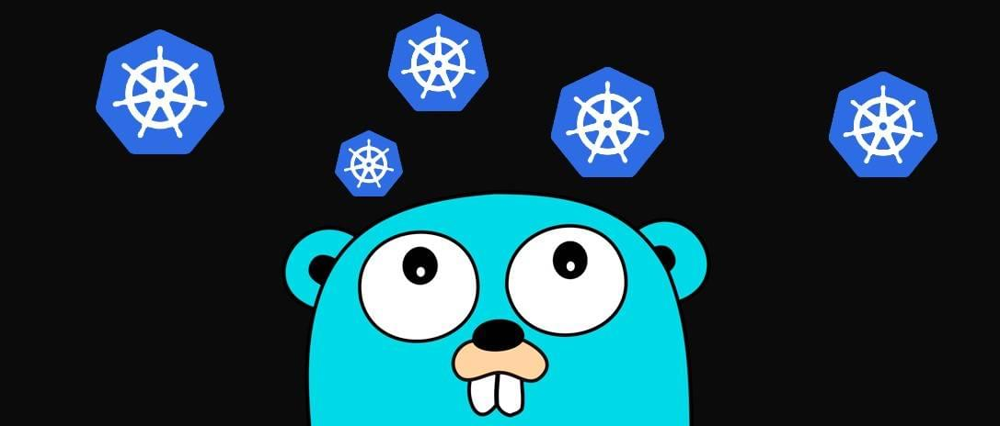

# **[Tương tác với cụm Kubernetes bằng Golang](https://ductn.info/Controller-Kubernetes-with-Golang)**

## **Giới thiệu**

  Kubernetes cung cấp cho chúng ta một thư viện khá xịn xò tên là
[client-go](https://github.com/kubernetes/client-go) :3. Trong bài viết này,
mình sẽ sử dụng thư viện này để tạo ra một chương trình nho nhỏ để có thể tương
tác tới cụm Kubernetes (Mình mới tìm hiểu về cái này thôi, anh em nào biết hoặc
có sản phẩm nào hay ho thì chia sẻ mình với 🎯🎯🎯).

  Mình sử dụng ngôn ngữ **Golang** để code và dùng **minikube** để tạo cụm
Kubernetes. Anh em có follow theo bài viết của mình thì nhớ cài 2 cái này nhé,
còn anh em nào có sẵn cụm k8s thì cài golang và múc thôi :3. *OK!!! Chiến*

  <p align="center">
    
  </p>

## **Demo**

  Sau khi cài đặt xong Golang và minikube xong, tiến hành start cụm minikube

```bash
➜  list_pods git:(master) ✗ minikube start
😄  minikube v1.20.0 on Darwin 10.15.7
✨  Automatically selected the docker driver. Other choices: hyperkit, virtualbox, ssh
👍  Starting control plane node minikube in cluster minikube
🚜  Pulling base image ...
🔥  Creating docker container (CPUs=2, Memory=1987MB) ...
🐳  Preparing Kubernetes v1.20.2 on Docker 20.10.6 ...
    ▪ Generating certificates and keys ...
    ▪ Booting up control plane ...
    ▪ Configuring RBAC rules ...
🔎  Verifying Kubernetes components...
    ▪ Using image gcr.io/k8s-minikube/storage-provisioner:v5
🌟  Enabled addons: storage-provisioner, default-storageclass
🏄  Done! kubectl is now configured to use "minikube" cluster and "default" namespace by default
```

  Mình sẽ run `command` sau để liệt kê các **pods** đang chạy trong cụm minikube

```bash
➜  list_pods git:(master) ✗ kubectl get pod -A
NAMESPACE     NAME                               READY   STATUS    RESTARTS   AGE
kube-system   coredns-74ff55c5b-8l6k6            1/1     Running   0          102m
kube-system   etcd-minikube                      1/1     Running   0          103m
kube-system   kube-apiserver-minikube            1/1     Running   0          103m
kube-system   kube-controller-manager-minikube   1/1     Running   0          103m
kube-system   kube-proxy-b5qd8                   1/1     Running   0          102m
kube-system   kube-scheduler-minikube            1/1     Running   0          103m
kube-system   storage-provisioner                1/1     Running   1          103m
```

  Bây giờ, mình sẽ viết chương trình để tương tác tới cụm **minikube** và thực
thi để lấy ra tên các **pods** đang chạy giống `command` trên (nhưng để đơn giản
thì mình chỉ run lấy ra trường **NAME** thôi :3). *Code thôi :3*

  Đầu tiên, anh em khởi tạo và cài đặt thư viện cần thiết cho chương trình

```bash
➜  list_pods go mod init list_pods
go: creating new go.mod: module list_pods
➜  list_pods go get -u k8s.io/client-go
go get: added k8s.io/client-go v0.22.0
➜  list_pods go get -u k8s.io/apimachinery
go get: added k8s.io/apimachinery v0.22.0
```

  Sau khi cài đặt xong, anh em tạo file [main.go](#) và tiến hành code.
*Source code mình sẽ để tại [đây](https://github.com/ductnn/Kubernetes-client-go-mini/tree/master/list_pods)*

  **Bước 1**: Import các thư viện cần thiết vào chương trình

```golang
package main

import (
	"context"
	"fmt"
	"os"

	metav1 "k8s.io/apimachinery/pkg/apis/meta/v1"
	"k8s.io/client-go/kubernetes"
	"k8s.io/client-go/tools/clientcmd"
	"k8s.io/client-go/util/homedir"
)
```

  **Bước 2**: Chúng ta code để lấy file config của Kubernetes từ thư mục của
kubernetes khi cài đặt, dưới đây là code để lấy đường dẫn file config.

```bash
var kube_config_path string
home_dir := homedir.HomeDir()

if _, err := os.Stat(home_dir + "/.kube/config"); err == nil {
    kube_config_path = home_dir + "/.kube/config"
} else {
    fmt.Println("Enter kubernetes config directory: ")
    fmt.Scanf("%s", kube_config_path)
}

fmt.Println(kube_config_path)
```

Kết quả của chương trình trên sẽ trả về đường dẫn của file config

```bash
➜  list_pods git:(master) ✗ go run main.go
/Users/ductn/.kube/config
```

  **Note**: Bước 2 anh em có thể bỏ qua bằng cách gán trực tiếp đường dẫn vào
biến `kube_config_path := "/Users/ductn/.kube/config"`, anh em dùng ubuntu thì
thường file cấu hình sẽ nằm tại `/home/(userid)/.kube/config`, mình dùng MacOS
nên file cấu hình của kubernetes nằm tại `/Users/ductn/.kube/config`.

  **Bước 3**: Sau khi lấy đường dẫn file cấu hình, ta tiến hành đọc và build
cấu hình cho chương trình. Mình sử dụng [clientcmd API](https://pkg.go.dev/k8s.io/client-go/tools/clientcmd)
anh em nên bỏ chút time để đọc nhé 😁😁😁.

```golang
// Build configuration from config file
config, err := clientcmd.BuildConfigFromFlags("", kube_config_path)
if err != nil {
    panic(err)
}
```

  **Bước 4**: Sau đó, tạo `clientset` để có thể gọi APIs

```golang
// Create clientser
clientset, err := kubernetes.NewForConfig(config)
if err != nil {
    panic(err)
}
```

  **Bước 5**: Tiếp theo, truy xuất list các pods trong cụm kubernetes. Do
kubernetes được viết bằng Go nên ta có thể dùng trực tiếp API do kubernetes
cung cấp 😁😁😁.

```golang
// Create pods
pod, err := clientset.CoreV1().Pods("").List(context.TODO(), metav1.ListOptions{})
if err != nil {
    panic(err)
}
```

  **Bước 6**: Cuối cùng, mình sẽ list ra tên các pods trong cụm kubernetes.

```golang
// Print list pods
for _, pod := range pod.Items {
    fmt.Printf("Pod name=/%s\n", pod.GetName())
}
```

  **Done!!!** Cùng kiểm tra thành quả nào 🤪🤪🤪

```bash
➜  list_pods git:(master) ✗ go run main.go
/Users/ductn/.kube/config
Pod name=/coredns-74ff55c5b-8l6k6
Pod name=/etcd-minikube
Pod name=/kube-apiserver-minikube
Pod name=/kube-controller-manager-minikube
Pod name=/kube-proxy-b5qd8
Pod name=/kube-scheduler-minikube
Pod name=/storage-provisioner
```

  He he :v vậy là xong :3. Trông cũng hịn hịn nhỷ 🤪🤪🤪. Hy vọng, bài viết này
của mình sẽ giúp anh em hiểu được phần nào ứng dụng của thư viện [client-go](https://github.com/kubernetes/client-go) 🎉🎉🎉. Anh em cho mình xin ý kiến và có ý tưởng gì hay hay thì còm men để mình có làm
thử thêm.

  Cảm ơn anh em đã đọc 😄😄😄.
