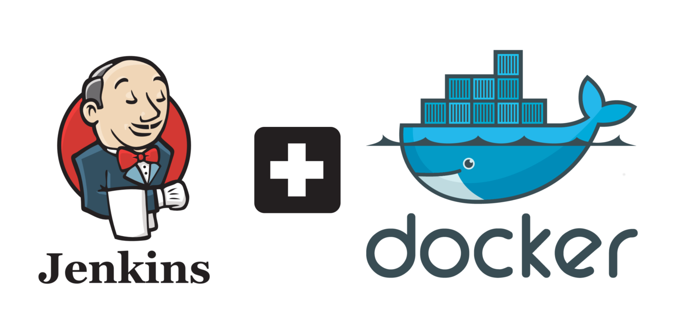
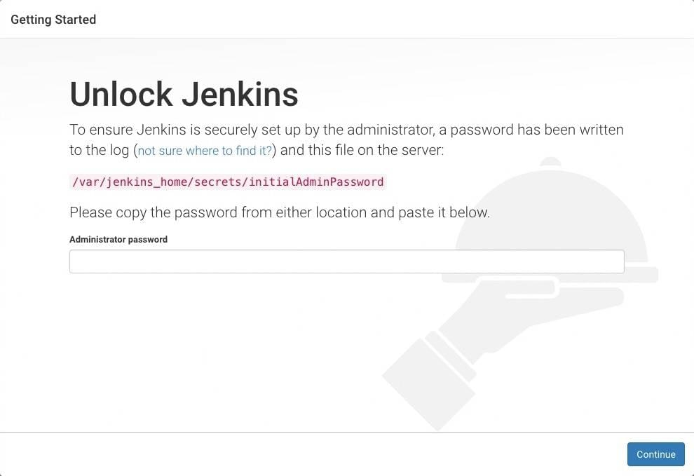
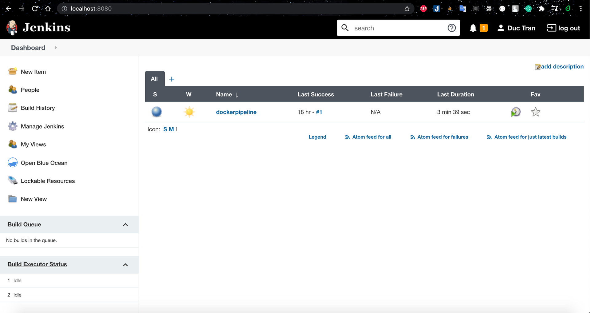
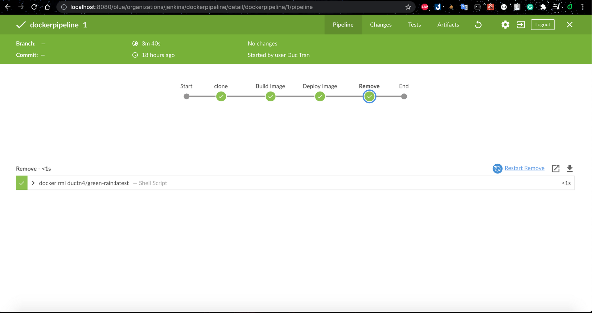

# **Install Jenkins with Docker 🐳 🐳 🐳**

  <p align="center">
    
  </p>

## **Downloading and running Jenkins on Docker**

  The recommended Docker image to use is the Official [jenkins/jenkins](https://hub.docker.com/r/jenkins/jenkins/)
image from Docker hub repo. A new [jenkins/jenkins](https://hub.docker.com/r/jenkins/jenkins/)
image is published each time a new release of Jenkins Docker is published (Don't
use [Jenkins](https://hub.docker.com/_/jenkins) image - Already **deprecated**).
*OK!!! Let's start*.

  **Note**: To install `Jenkins`, we need to deploy 2 containers: `docker:dind`
and `jenkins/jenkins`.

  **Step 1**: Create bridge network for 2 container

```bash
docker network create jenkins
```

  **Step 2**: Setup `docker:dind` **(DinD: Docker-in-Docker)**: is just what it
says *running Docker inside a Docker container*

```bash
docker run --name jenkins-docker -d \
  --privileged --network jenkins --network-alias docker \
  --env DOCKER_TLS_CERTDIR=/certs \
  --volume ~/docker-certs-jk:/certs/client \
  --volume ~/jenkins-home:/var/jenkins_home \
  -p 2376:2376 docker:dind --storage-driver overlay2
```

  `--privileged`: Running Docker in Docker currently requires privileged access
to function properly.

  `--network-alias docker`: Makes the Docker in Docker container available as
the hostname docker within the jenkins network.

  `--env DOCKER_TLS_CERTDIR=/certs`: Enables the use of TLS in the Docker server.

  `--volume ~/jenkins-home:/var/jenkins_home`: Mounting volume `jenkins-home` to
workspace directory of Jenkins.

  **Steps 3**: Deploy container `Jenkins`. We can use command to run container:

```bash
docker run --name jenkins -d \
  --network jenkins --env DOCKER_HOST=tcp://docker:2376 \
  --env DOCKER_CERT_PATH=/certs/client --env DOCKER_TLS_VERIFY=1 \
  -p 8080:8080 -p 50000:50000 \
  -v ~/jenkins_home:/var/jenkins_home \
  -v ~/docker-certs-jk:/certs/client:ro \
  jenkins/jenkins:2.289.3-lts-jdk11
```

  But i'll custom for my new `jenkins image`. *Create Dockerfile*:

```Dockerfile
FROM jenkins/jenkins:2.289.3-lts-jdk11

USER root

RUN apt-get update && apt-get install -y apt-transport-https \
    ca-certificates curl gnupg2 \
    software-properties-common
RUN curl -fsSL https://download.docker.com/linux/debian/gpg | apt-key add -
RUN apt-key fingerprint 0EBFCD88
RUN add-apt-repository \
     "deb [arch=amd64] https://download.docker.com/linux/debian \
     $(lsb_release -cs) stable"
RUN apt-get update && apt-get install -y docker-ce-cli

USER jenkins
```

  Navigate to directory with `Dockerfile` and build new image:

```bash
docker build -t jenkins-new:v1 .
```

  Then, we run the new jenkins image as container in Docker:

```bash
docker run --name jenkins -d \
  --network jenkins --env DOCKER_HOST=tcp://docker:2376 \
  --env DOCKER_CERT_PATH=/certs/client --env DOCKER_TLS_VERIFY=1 \
  -p 8080:8080 -p 50000:50000 \
  -v ~/jenkins_home:/var/jenkins_home \
  -v ~/docker-certs-jk:/certs/client:ro \
  jenkins-new:v1
```

  **Check our result**:

```bash
➜  jenkins git:(main) ✗ docker ps
CONTAINER ID   IMAGE            COMMAND                  CREATED        STATUS         PORTS                                                                                      NAMES
d5609c0f9f69   jenkins-new:v1   "/sbin/tini -- /usr/…"   18 hours ago   Up 9 seconds   0.0.0.0:8080->8080/tcp, :::8080->8080/tcp, 0.0.0.0:50000->50000/tcp, :::50000->50000/tcp   jenkins
339877c8ca20   docker:dind      "dockerd-entrypoint.…"   18 hours ago   Up 5 seconds   2375/tcp, 0.0.0.0:2376->2376/tcp, :::2376->2376/tcp                                        jenkins-docker
```

  Now, we need to config `Jenkins` after installation, let access the dashboard 
at `localhost:8080`, and unlock jenkins using password:

  <p align="center">
    
  </p>

  Follow the tutorial, we can take the password at `/var/lib/jenkins/secrets/initialAdminPassword`

```bash
CONTAINER ID   IMAGE            COMMAND                  CREATED        STATUS          PORTS                                                                                      NAMES
d5609c0f9f69   jenkins-new:v1   "/sbin/tini -- /usr/…"   19 hours ago   Up 29 minutes   0.0.0.0:8080->8080/tcp, :::8080->8080/tcp, 0.0.0.0:50000->50000/tcp, :::50000->50000/tcp   jenkins
339877c8ca20   docker:dind      "dockerd-entrypoint.…"   19 hours ago   Up 29 minutes   2375/tcp, 0.0.0.0:2376->2376/tcp, :::2376->2376/tcp                                        jenkins-docker
➜  jenkins git:(main) ✗ docker exec -it d5 bash
jenkins@d5609c0f9f69:/$ cat /var/lib/jenkins/secrets/initialAdminPassword
YOUR_PASSWORD_IN_HERE
```

  After unlock jenkins, the Customize Jenkins page appears. We choose `Install suggested plugins`,
and `Create Admin User`. `Jenkins` ready to use 🤟 🤟 🤟.

  <p align="center">
    
  </p>

  And we can install `BlueOcean` plugins (GUI for CI/CD Pipeline)

  <p align="center">
    
  </p>

  OK Done !!! Thanks you for reading my article 🥰🥰🥰

## References
* [Docker DinD](https://blog.nestybox.com/2019/09/14/dind.html)
* [Jenkins](https://www.jenkins.io/)
