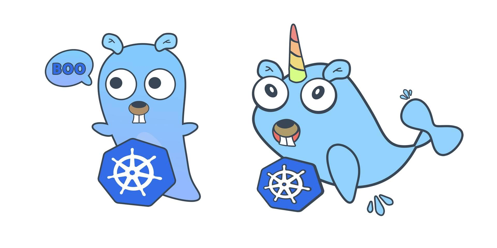
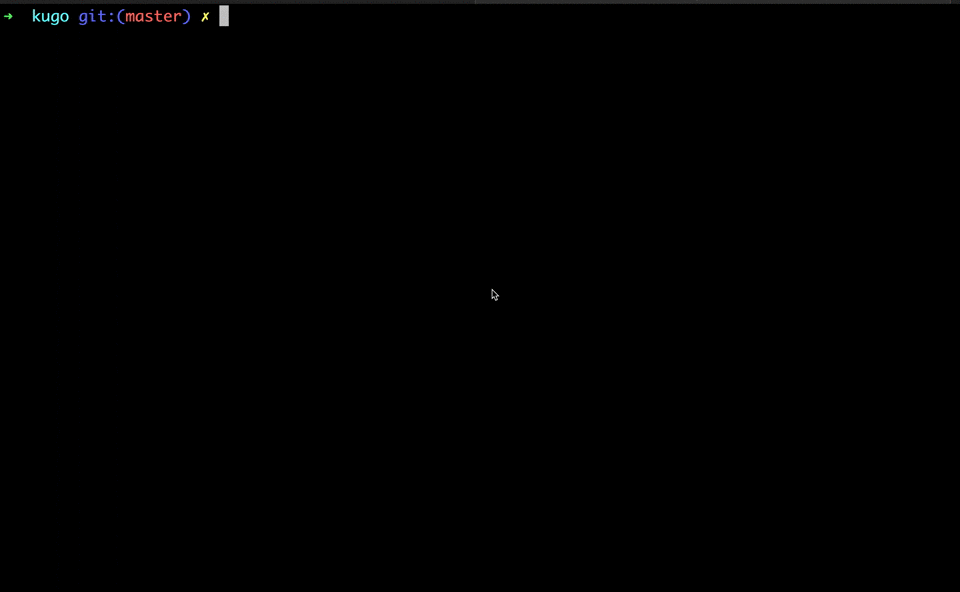

## **[Tương tác với cụm Kubernetes sử dụng Golang P2](https://ductn.info/controller-kubernetes-with-golang-2/)**

  <p align="center">
    
  </p>

### **Giới thiệu**

  Nối tiếp [phần 1](https://ductn.info/controller-kubernetes-with-golang/)
mình làm tiếp 1 `tool` cho cụm kubernetes sử dụng thư viện [client-go](https://github.com/kubernetes/client-go).

  Ở phần trước, mình đã demo in ra list tên của các `pods` trong cụm `kubernetes`,
trong phần này mình sẽ làm 1 tool giúp chúng có thể **update** phiên bản `image`
đang được sử dụng trong `deployment` và deploy lại container theo image mới.

  Trông ứng dụng sẽ như thế này :3 

  <p align="center">
    
  </p>

  *Link source code đây nha: https://github.com/ductnn/kugo*

### **Start**

  Vẫn giống như [phần trước](https://viblo.asia/p/tuong-tac-voi-kubernetes-su-dung-golang-LzD5dW30ljY),
để bắt đầu anh em cài đặt *golang* và set up cụm *kubernetes*, sau đó anh em có
thể xem lại `bước 1-2` ở phần 1 để khởi tạo tool nhé :3.

```golang
package main

import (
	"context"
	"flag"
	"fmt"
	"os"

	"k8s.io/apimachinery/pkg/api/errors"
	metav1 "k8s.io/apimachinery/pkg/apis/meta/v1"
	"k8s.io/client-go/kubernetes"
	"k8s.io/client-go/tools/clientcmd"
	"k8s.io/client-go/util/homedir"
)

// Kube config path
func GetKubeConfigPath() string {
	var kubeConfigPath string
	homeDir := homedir.HomeDir()

	if _, err := os.Stat(homeDir + "/.kube/config"); err == nil {
		kubeConfigPath = homeDir + "/.kube/config"
	} else {
		fmt.Println("Enter kubernetes config directory: ")
		fmt.Scanf("%s", kubeConfigPath)
	}

	return kubeConfigPath
}

func main() {
	// Set Kube config
	kubeConfigPath := GetKubeConfigPath()
	fmt.Println(kubeConfigPath)

	// Build configuration from config file
	config, err := clientcmd.BuildConfigFromFlags("", kubeConfigPath)
	if err != nil {
		panic(err)
	}

	// Create clientser
	clientset, err := kubernetes.NewForConfig(config)
	if err != nil {
		panic(err)
	}
}
```

  Mình sử dụng [flag](https://pkg.go.dev/flag) là package nổi tiếng của golang
hỗ trợ chúng ta truyền vào các `flags` ở `command`. Ví dụ như *demo* ở bên trên
mình truyền vào 3 `flags` sau khi build file [main.go](#).

```bash
-deployment test-app
-app test-app
-image ductn4/green-rain:v2
```

  Chúng ta sẽ dùng `flag` để tạo những commad flags như ví dụ trên. Chúng ta có 
thể sử dụng `os.Args[]` từ `os package`. Đối với `cli tool` nhỏ thì dùng `os.Args[]`
xong check. Còn không dùng `flag` sẽ tiện hơn. Ngoài ra, `flag` hỗ trợ luôn `-h`
cho chúng ta để show ra ý nghĩa của flag trong command:

```bash
➜  kugo git:(master) ✗ ./main -h
/Users/ductn/.kube/config
Usage of ./main:
  -app string
    	application name (default "app")
  -deployment string
    	deployment name
  -image string
    	new image name
```

  OK!!! Bắt đầu tạo ra các `flags`:

```golang
deploymentName := flag.String("deployment", "", "deployment name")
imageName := flag.String("image", "", "new image name")
appName := flag.String("app", "app", "application name")

flag.Parse()

if *deploymentName == "" {
    fmt.Println("The deployment name must be specify.")
    os.Exit(0)
}
if *imageName == "" {
    fmt.Println("The new image name must be specify.")
    os.Exit(0)
}
```

  `-deployment name:<string>`: Tên của `deployment` đang chạy.

  `-app name:<string>`: Tên của ứng dụng đang chạy.

  `-image name:<string>`: Tên image mới cần deploy.

  Sau khi tạo xong `flag`, chúng ta khởi tạo `deployment`, phần này giống như
khởi tạo `pods` trong phần trước:

```golang
// Create Deployment
deployment, err := clientset.AppsV1().Deployments("default").Get(context.TODO(), *deploymentName, metav1.GetOptions{})
if err != nil {
    panic(err)
}
```

  Tiếp theo, chúng ta thực hiện check để kiểm tra trạng thái của `deployment`
xem có bị lỗi hoặc chưa deploy:

```golang
if errors.IsNotFound(err) {
    fmt.Printf("Deployment not found\n")
} else if statusError, isStatus := err.(*errors.StatusError); isStatus {
    fmt.Printf("Error getting deployment%v\n", statusError.ErrStatus.Message)
} else if err != nil {
    panic(err)
} else {
    // Next step ...
}
```

  Kiểm tra xong, chúng ta sẽ thực hiện thay thế `image` cũ thành `image` mới:

```golang
containers := &deployment.Spec.Template.Spec.Containers
found := false

for i := range *containers {
    c := *containers
    if c[i].Name == *appName {
        fmt.Println("Old Version Image: ", c[i].Image)
        fmt.Println("New Version Image: ", *imageName)
        c[i].Image = *imageName
        found = true
    }
}
```

  Cuối cùng, chúng ta sẽ `update` lại `deployment` theo phiên bản mới của `image`

```golang
_, err := clientset.AppsV1().Deployments("default").Update(context.TODO(), deployment, metav1.UpdateOptions{})
if err != nil {
    panic(err)
}
```

### **Demo**

  **Bước 1**: Mình sẽ deploy 1 `deployment` cùng với `service: NodePort`, mình
có tạo sẵn 1 file `deployment` ở [đây](https://github.com/ductnn/kugo/blob/master/test/deployment.yml)
anh em có thể dùng luôn:

```bash
➜  test git:(master) ✗ kubectl apply -f deployment.yml
service/app-service created
deployment.apps/test-app created
➜  test git:(master) ✗ kubectl get all
NAME                            READY   STATUS    RESTARTS   AGE
pod/test-app-64d48d75c7-ctztl   1/1     Running   0          51s

NAME                  TYPE        CLUSTER-IP     EXTERNAL-IP   PORT(S)          AGE
service/app-service   NodePort    10.99.148.96   <none>        3000:32691/TCP   51s
service/kubernetes    ClusterIP   10.96.0.1      <none>        443/TCP          3m31s

NAME                       READY   UP-TO-DATE   AVAILABLE   AGE
deployment.apps/test-app   1/1     1            1           51s

NAME                                  DESIRED   CURRENT   READY   AGE
replicaset.apps/test-app-64d48d75c7   1         1         1       51s
```

  Mình sử dụng `image: ductn4/green-rain:v1.0.1` để build 1 hiệu ứng nhỏ, anh em
bật vô xem đẹp lắm :3

  **Bước 2**: Build đống code vừa viết nào :3, sau khi build xong sẽ sinh ra 1
file `main`

```bash
➜  kugo git:(master) ✗ go build main.go
➜  kugo git:(master) ✗ ls
README.md go.mod    go.sum    main      main.go   test
```

  **Bước 3**: Thực thi file `main` vừa tạo ra:

```bash
➜  kugo git:(master) ✗ ./main -deployment test-app -app test-app -image ductn4/green-rain:v2
/Users/ductn/.kube/config
Found deployment
Name deployment:  test-app
Old Version Image:  ductn4/green-rain:v1.0.1
New Version Image:  ductn4/green-rain:v2
```

  Anh em thấy đã có thông báo thay đổi version của `image`, Check tý coi :3

```bash
➜  kugo git:(master) ✗ kubectl describe pods test-app-67c5b469d7-9k6lb
Name:         test-app-67c5b469d7-9k6lb
Namespace:    default
Priority:     0
Node:         minikube/192.168.49.2
Start Time:   Mon, 16 Aug 2021 23:58:39 +0700
Labels:       app=test-app
              pod-template-hash=67c5b469d7
Annotations:  <none>
Status:       Running
IP:           172.17.0.4
IPs:
  IP:           172.17.0.4
Controlled By:  ReplicaSet/test-app-67c5b469d7
Containers:
  test-app:
    Container ID:   docker://bd06a004dee744207fd955191ed1df2e204254b1a44a2e1f0cc8e7c9bef20a4d
    Image:          ductn4/green-rain:v2
    Image ID:       docker-pullable://ductn4/green-rain@sha256:31ec7424010c546d7cc028bf0355ec9dd58e4818e8cc3e266ff44a9ff7a3c109
    Port:           3000/TCP
    Host Port:      0/TCP
    State:          Running
      Started:      Mon, 16 Aug 2021 23:58:48 +0700
    Ready:          True
    ...
```

  Vậy là `image` đã được update và deploy thành công, anh em vô xem lại hiệu ứng
nha, ver 2 nhìn xịn hơn ver 1 ở trên :3.

  Mình đã làm xong tiếp 1 cái tool nhỏ nữa, anh em nào còn có ý tưởng gì hay hay
chia sẻ để có thể cùng làm nha :3

  Cảm ơn anh em đã đọc 😄😄😄.
