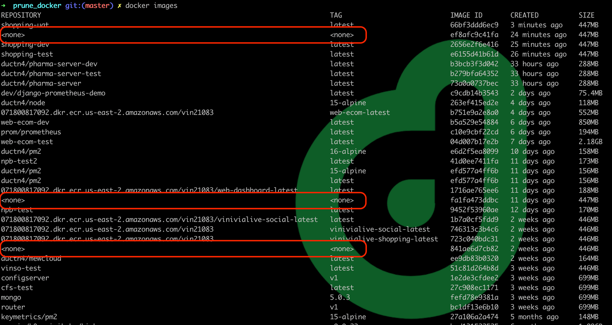
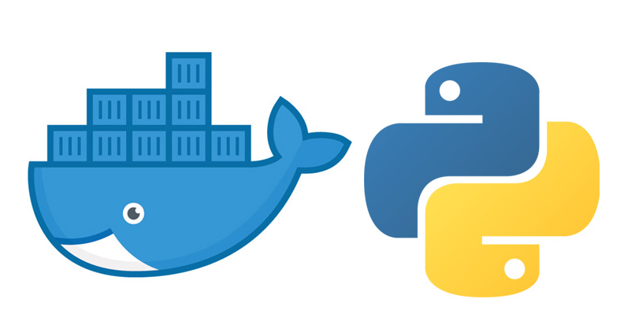
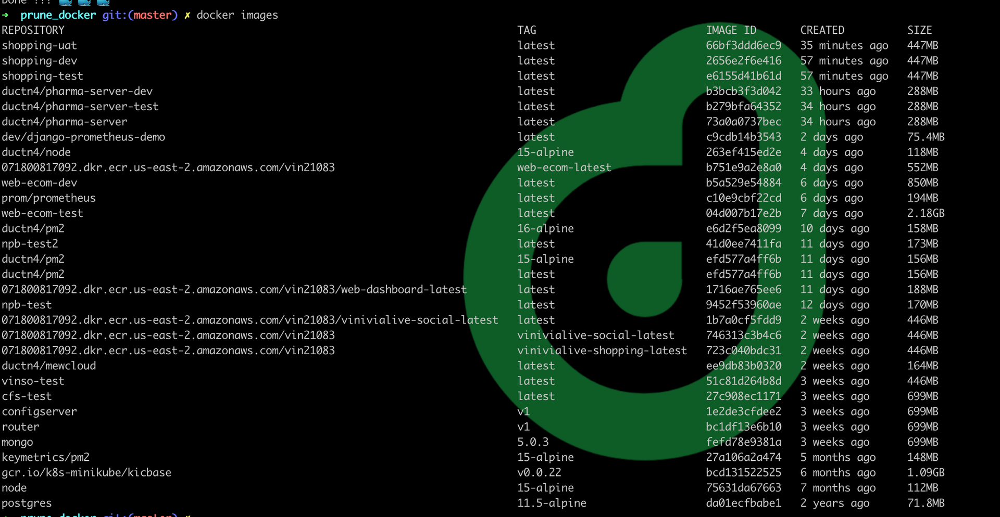

# **[Prune Docker](https://ductn.info/prune-docker/)**

## **In-trô**

  Hellu ae, lại là tôi chòi lên để xàm với mọi người đây ... Đừng đạp tôi xuống
nhé 😅 😅. Tiếp nối chuỗi ngày "rảnh", mình sẽ giới thiệu cho anh em 1 chiếc `tool`
nho nhỏ mình mới làm với `python`.

  Chả là dạo này mình phải build docker cho khá là nhiều app, mà mỗi một lần build
thì hay bị vướng vài lỗi linh tinh nên hay phải build lại. Cứ mỗi lần như vậy thì
máy mình có khá là nhiều `images` "rác" có tag là `<none>`, trông nó kiểu như này:

  <p align="center">
    
  </p>

  Cái ảnh này là mình xoá bớt đi rồi... Đó, nhìn khá là rối mắt và ức chế, nên
mình có viết ra 1 cái tool để xoá cái đống này đi. Ok, sau đây mình sẽ code và
demo thử cho anh em cùng xem.

  <p align="center">
    
  </p>

## **Demo**

  Source code của cái tool mình để trên **[github](https://github.com/ductnn/prune_docker)**
cho anh em tiện theo dõi. (Cho mình xin 1 ⭐ nếu anh em thấy hay nha, chỉ cần 1
cái thôi 😁 😁 😁).

  Cùng phân tích chút nhé. Để có thể xoá đi các images bị untagg, đầu tiên phải
xét xem có những images nào, mình dùng cách thông thường là `command` để check
trên `terminal`:

```bash
➜  ~ docker images
REPOSITORY                                                                        TAG                           IMAGE ID       CREATED        SIZE
ductn4/pharma-server-dev                                                          latest                        b3bcb3f3d042   2 days ago     288MB
ductn4/pharma-server-test                                                         latest                        b279bfa64352   2 days ago     288MB
<none>                                                                            <none>                        73a0a0737bec   2 days ago     288MB
<none>                                                                            <none>                        c9cdb14b3543   3 days ago     75.4MB
```

  Sau đó, chúng ta có thể sử dụng `command` `docker rmi -f [IMAGE ID]` để xoá đi
các images có tag là `<none>`. Nhưng đó là trong trường hợp số lượng ít, còn khi
mà anh em phải build nhiều mà chưa kịp xoá sẽ tràn ra rất nhiều, xoá tay như thế
sẽ rất mệt 😰, nên mình đã viết nhanh 1 cái tool để giúp xoá cho nhanh :V.

  Ở đây, mình sử dụng module **subprocess**, module này sẽ giúp tạo ra những
*process* mới và thực thi các *command*, anh em có thể đọc thêm trên docs của
python ở [đây](https://docs.python.org/3/library/subprocess.html). Ok, như ở
trên mình có sử dụng 2 commands là `docker images` và `docker rmi` để tương test,
bây giờ mình sẽ dùng module **subprocess** để gọi ra 2 command trên.

  *Anh em mở Interpreter của thằng python lên test nhé 😁*. Test in *"Hello World"*:

```bash
➜  ~ python3
Python 3.9.7 (default, Oct 13 2021, 06:44:56)
[Clang 12.0.0 (clang-1200.0.32.29)] on darwin
Type "help", "copyright", "credits" or "license" for more information.
>>> import subprocess
>>> subprocess.check_output(['echo', 'Hello world !!!'])
b'Hello world !!!\n'
```

  Test *command* `docker images`:

```bash
➜  ~ python3
Python 3.9.7 (default, Oct 13 2021, 06:44:56)
[Clang 12.0.0 (clang-1200.0.32.29)] on darwin
Type "help", "copyright", "credits" or "license" for more information.
>>> import subprocess
>>> s = subprocess.check_output(['docker', 'images'])
>>> s
b'REPOSITORY                                                                        TAG                           IMAGE ID       CREATED        SIZE\nductn4/pharma-server-dev                                                          latest                        b3bcb3f3d042   2 days ago     288MB\nductn4/pharma-server-test                                                         latest                        b279bfa64352   2 days ago     288MB\nductn4/pharma-server                                                              latest                        73a0a0737bec   2 days ago     288MB\ndev/django-prometheus-demo                                                        latest                        c9cdb14b3543   3 days ago     75.4MB\nductn4/node                                                                       15-alpine                     263ef415ed2e   5 days ago     118MB\n071800817092.dkr.ecr.us-east-2.amazonaws.com/vin21083                             web-ecom-latest               b751e9a2e8a0   5 days ago     552MB\nweb-ecom-dev                                                                      latest                        b5a529e54884   7 days ago     850MB\nprom/prometheus                                                                   latest                        c10e9cbf22cd   7 days ago     194MB\nweb-ecom-test                                                                     latest                        04d007b17e2b   8 days ago     2.18GB\nductn4/pm2                                                                        16-alpine                     e6d2f5ea8099   10 days ago    158MB\nnpb-test2                                                                         latest                        41d0ee7411fa   11 days ago    173MB\nductn4/pm2                                                                        15-alpine                     efd577a4ff6b   12 days ago    156MB\nductn4/pm2                                                                        latest                        efd577a4ff6b   12 days ago    156MB\n071800817092.dkr.ecr.us-east-2.amazonaws.com/vin21083/web-dashboard-latest        latest                        1716ae765ee6   12 days ago    188MB\nnpb-test                                                                          latest                        9452f53960ae   12 days ago    170MB\n071800817092.dkr.ecr.us-east-2.amazonaws.com/vin21083/vinivialive-social-latest   latest                        1b7a0cf5fdd9   2 weeks ago    446MB\n071800817092.dkr.ecr.us-east-2.amazonaws.com/vin21083                             vinivialive-social-latest     746313c3b4c6   2 weeks ago    446MB\n071800817092.dkr.ecr.us-east-2.amazonaws.com/vin21083                             vinivialive-shopping-latest   723c040bdc31   2 weeks ago    446MB\nductn4/mewcloud                                                                   latest                        ee9db83b0320   2 weeks ago    164MB\nvinso-test                                                                        latest                        51c81d264b8d   3 weeks ago    446MB\nmongo                                                                             5.0.3                         fefd78e9381a   4 weeks ago    699MB\nkeymetrics/pm2                                                                    15-alpine                     27a106a2a474   5 months ago   148MB\ngcr.io/k8s-minikube/kicbase                                                       v0.0.22                       bcd131522525   6 months ago   1.09GB\nnode                                                                              15-alpine                     75631da67663   7 months ago   112MB\npostgres                                                                          11.5-alpine                   da01ecfbabe1   2 years ago    71.8MB\n'
```

  Hình như hơi dài... Tiếp theo, mình sẽ truyền thêm arg `encoding='ascii'` vào:

```bash
>>> s = subprocess.check_output(['docker', 'images'], encoding='ascii')
>>> s
'REPOSITORY                                                                        TAG                           IMAGE ID       CREATED        SIZE\nductn4/pharma-server-dev                                                          latest                        b3bcb3f3d042   2 days ago     288MB\nductn4/pharma-server-test                                                         latest                        b279bfa64352   2 days ago     288MB\nductn4/pharma-server                                                              latest                        73a0a0737bec   2 days ago     288MB\ndev/django-prometheus-demo                                                        latest                        c9cdb14b3543   3 days ago     75.4MB\nductn4/node                                                                       15-alpine                     263ef415ed2e   5 days ago     118MB\n071800817092.dkr.ecr.us-east-2.amazonaws.com/vin21083                             web-ecom-latest               b751e9a2e8a0   5 days ago     552MB\nweb-ecom-dev                                                                      latest                        b5a529e54884   7 days ago     850MB\nprom/prometheus                                                                   latest                        c10e9cbf22cd   7 days ago     194MB\nweb-ecom-test                                                                     latest                        04d007b17e2b   8 days ago     2.18GB\nductn4/pm2                                                                        16-alpine                     e6d2f5ea8099   10 days ago    158MB\nnpb-test2                                                                         latest                        41d0ee7411fa   11 days ago    173MB\nductn4/pm2                                                                        15-alpine                     efd577a4ff6b   12 days ago    156MB\nductn4/pm2                                                                        latest                        efd577a4ff6b   12 days ago    156MB\n071800817092.dkr.ecr.us-east-2.amazonaws.com/vin21083/web-dashboard-latest        latest                        1716ae765ee6   12 days ago    188MB\nnpb-test                                                                          latest                        9452f53960ae   12 days ago    170MB\n071800817092.dkr.ecr.us-east-2.amazonaws.com/vin21083/vinivialive-social-latest   latest                        1b7a0cf5fdd9   2 weeks ago    446MB\n071800817092.dkr.ecr.us-east-2.amazonaws.com/vin21083                             vinivialive-social-latest     746313c3b4c6   2 weeks ago    446MB\n071800817092.dkr.ecr.us-east-2.amazonaws.com/vin21083                             vinivialive-shopping-latest   723c040bdc31   2 weeks ago    446MB\nductn4/mewcloud                                                                   latest                        ee9db83b0320   2 weeks ago    164MB\nvinso-test                                                                        latest                        51c81d264b8d   3 weeks ago    446MB\nmongo                                                                             5.0.3                         fefd78e9381a   4 weeks ago    699MB\nkeymetrics/pm2                                                                    15-alpine                     27a106a2a474   5 months ago   148MB\ngcr.io/k8s-minikube/kicbase                                                       v0.0.22                       bcd131522525   6 months ago   1.09GB\nnode                                                                              15-alpine                     75631da67663   7 months ago   112MB\npostgres                                                                          11.5-alpine                   da01ecfbabe1   2 years ago    71.8MB\n'
``` 

  Anh em thấy kết quả của command trên sẽ trả ra các trường thông tin tương ứng
của **images** như sau `['REPOSITORY', 'TAG', 'IMAGE ID', 'CREATED', 'SIZE']`.
Tiếp theo, mình sẽ đưa phần `output` này vào `array`:

```python
output = [
    [i.strip() for i in line.split('  ') if i.strip()]
    for line in subprocess.check_output(
        ['docker', 'images'],
        encoding='ascii'
    ).splitlines()
]
```

  Và trông nó sẽ như này:

```bash
[['REPOSITORY', 'TAG', 'IMAGE ID', 'CREATED', 'SIZE'], ['ductn4/pharma-server-dev', 'latest', 'b3bcb3f3d042', '2 days ago', '288MB'], ['ductn4/pharma-server-test', 'latest', 'b279bfa64352', '2 days ago', '288MB'], ['ductn4/pharma-server', 'latest', '73a0a0737bec', '2 days ago', '288MB'], ['dev/django-prometheus-demo', 'latest', 'c9cdb14b3543', '3 days ago', '75.4MB'], ['ductn4/node', '15-alpine', '263ef415ed2e', '5 days ago', '118MB'], ['071800817092.dkr.ecr.us-east-2.amazonaws.com/vin21083', 'web-ecom-latest', 'b751e9a2e8a0', '5 days ago', '552MB'], ['web-ecom-dev', 'latest', 'b5a529e54884', '7 days ago', '850MB'], ['prom/prometheus', 'latest', 'c10e9cbf22cd', '7 days ago', '194MB'], ['web-ecom-test', 'latest', '04d007b17e2b', '8 days ago', '2.18GB'], ['ductn4/pm2', '16-alpine', 'e6d2f5ea8099', '10 days ago', '158MB'], ['npb-test2', 'latest', '41d0ee7411fa', '11 days ago', '173MB'], ['ductn4/pm2', '15-alpine', 'efd577a4ff6b', '12 days ago', '156MB'], ['ductn4/pm2', 'latest', 'efd577a4ff6b', '12 days ago', '156MB'], ['071800817092.dkr.ecr.us-east-2.amazonaws.com/vin21083/web-dashboard-latest', 'latest', '1716ae765ee6', '12 days ago', '188MB'], ['npb-test', 'latest', '9452f53960ae', '12 days ago', '170MB'], ['071800817092.dkr.ecr.us-east-2.amazonaws.com/vin21083/vinivialive-social-latest', 'latest', '1b7a0cf5fdd9', '2 weeks ago', '446MB'], ['071800817092.dkr.ecr.us-east-2.amazonaws.com/vin21083', 'vinivialive-social-latest', '746313c3b4c6', '2 weeks ago', '446MB'], ['071800817092.dkr.ecr.us-east-2.amazonaws.com/vin21083', 'vinivialive-shopping-latest', '723c040bdc31', '2 weeks ago', '446MB'], ['ductn4/mewcloud', 'latest', 'ee9db83b0320', '2 weeks ago', '164MB'], ['vinso-test', 'latest', '51c81d264b8d', '3 weeks ago', '446MB'], ['mongo', '5.0.3', 'fefd78e9381a', '4 weeks ago', '699MB'], ['keymetrics/pm2', '15-alpine', '27a106a2a474', '5 months ago', '148MB'], ['gcr.io/k8s-minikube/kicbase', 'v0.0.22', 'bcd131522525', '6 months ago', '1.09GB'], ['node', '15-alpine', '75631da67663', '7 months ago', '112MB'], ['postgres', '11.5-alpine', 'da01ecfbabe1', '2 years ago', '71.8MB']]
```

  Ok, tiếp tục tách riêng trường tên và thông tin tương ứng của các trường:

```python
output = [
  ...
]

headers, rows = output[0], output[1:]
```

```bash
# This is headers
['REPOSITORY', 'TAG', 'IMAGE ID', 'CREATED', 'SIZE']

# This is rows
[['ductn4/pharma-server-dev', 'latest', 'b3bcb3f3d042', '2 days ago', '288MB'], ['ductn4/pharma-server-test', 'latest', 'b279bfa64352', '2 days ago', '288MB'], ['ductn4/pharma-server', 'latest', '73a0a0737bec', '2 days ago', '288MB'], ['dev/django-prometheus-demo', 'latest', 'c9cdb14b3543', '3 days ago', '75.4MB'], ['ductn4/node', '15-alpine', '263ef415ed2e', '5 days ago', '118MB'], ['071800817092.dkr.ecr.us-east-2.amazonaws.com/vin21083', 'web-ecom-latest', 'b751e9a2e8a0', '5 days ago', '552MB'], ['web-ecom-dev', 'latest', 'b5a529e54884', '7 days ago', '850MB'], ['prom/prometheus', 'latest', 'c10e9cbf22cd', '7 days ago', '194MB'], ['web-ecom-test', 'latest', '04d007b17e2b', '8 days ago', '2.18GB'], ['ductn4/pm2', '16-alpine', 'e6d2f5ea8099', '10 days ago', '158MB'], ['npb-test2', 'latest', '41d0ee7411fa', '11 days ago', '173MB'], ['ductn4/pm2', '15-alpine', 'efd577a4ff6b', '12 days ago', '156MB'], ['ductn4/pm2', 'latest', 'efd577a4ff6b', '12 days ago', '156MB'], ['071800817092.dkr.ecr.us-east-2.amazonaws.com/vin21083/web-dashboard-latest', 'latest', '1716ae765ee6', '12 days ago', '188MB'], ['npb-test', 'latest', '9452f53960ae', '12 days ago', '170MB'], ['071800817092.dkr.ecr.us-east-2.amazonaws.com/vin21083/vinivialive-social-latest', 'latest', '1b7a0cf5fdd9', '2 weeks ago', '446MB'], ['071800817092.dkr.ecr.us-east-2.amazonaws.com/vin21083', 'vinivialive-social-latest', '746313c3b4c6', '2 weeks ago', '446MB'], ['071800817092.dkr.ecr.us-east-2.amazonaws.com/vin21083', 'vinivialive-shopping-latest', '723c040bdc31', '2 weeks ago', '446MB'], ['ductn4/mewcloud', 'latest', 'ee9db83b0320', '2 weeks ago', '164MB'], ['vinso-test', 'latest', '51c81d264b8d', '3 weeks ago', '446MB'], ['mongo', '5.0.3', 'fefd78e9381a', '4 weeks ago', '699MB'], ['keymetrics/pm2', '15-alpine', '27a106a2a474', '5 months ago', '148MB'], ['gcr.io/k8s-minikube/kicbase', 'v0.0.22', 'bcd131522525', '6 months ago', '1.09GB'], ['node', '15-alpine', '75631da67663', '7 months ago', '112MB'], ['postgres', '11.5-alpine', 'da01ecfbabe1', '2 years ago', '71.8MB']]
```

  Trông cũng hòm hòm nhưng mà chưa xong được :V. Sau đó, mình sẽ "merge" 2 mảng
*headers* và *rows* lại với nhau:

```python
def pad_list(items, pad_to=10, pad_with=''):
    if len(items) >= pad_to:
        return items

    return items + [pad_with for i in range(0, pad_to - len(items))]


def namedtuplify(headers, rows):
    max_cols = len(headers)
    Row = namedtuple(
        'Row',
        [col_name.replace(' ', '') for col_name in headers]
    )
    rows = [Row(*pad_list(row, pad_to=max_cols)) for row in rows]

    return rows
```

  Kết quả:

```bash
[Row(REPOSITORY='ductn4/pharma-server-dev', TAG='latest', IMAGEID='b3bcb3f3d042', CREATED='2 days ago', SIZE='288MB'), Row(REPOSITORY='ductn4/pharma-server-test', TAG='latest', IMAGEID='b279bfa64352', CREATED='2 days ago', SIZE='288MB'), Row(REPOSITORY='ductn4/pharma-server', TAG='latest', IMAGEID='73a0a0737bec', CREATED='2 days ago', SIZE='288MB'), Row(REPOSITORY='dev/django-prometheus-demo', TAG='latest', IMAGEID='c9cdb14b3543', CREATED='3 days ago', SIZE='75.4MB'), Row(REPOSITORY='ductn4/node', TAG='15-alpine', IMAGEID='263ef415ed2e', CREATED='5 days ago', SIZE='118MB'), Row(REPOSITORY='071800817092.dkr.ecr.us-east-2.amazonaws.com/vin21083', TAG='web-ecom-latest', IMAGEID='b751e9a2e8a0', CREATED='5 days ago', SIZE='552MB'), Row(REPOSITORY='web-ecom-dev', TAG='latest', IMAGEID='b5a529e54884', CREATED='7 days ago', SIZE='850MB'), Row(REPOSITORY='prom/prometheus', TAG='latest', IMAGEID='c10e9cbf22cd', CREATED='7 days ago', SIZE='194MB'), Row(REPOSITORY='web-ecom-test', TAG='latest', IMAGEID='04d007b17e2b', CREATED='8 days ago', SIZE='2.18GB'), Row(REPOSITORY='ductn4/pm2', TAG='16-alpine', IMAGEID='e6d2f5ea8099', CREATED='10 days ago', SIZE='158MB'), Row(REPOSITORY='npb-test2', TAG='latest', IMAGEID='41d0ee7411fa', CREATED='11 days ago', SIZE='173MB'), Row(REPOSITORY='ductn4/pm2', TAG='15-alpine', IMAGEID='efd577a4ff6b', CREATED='12 days ago', SIZE='156MB'), Row(REPOSITORY='ductn4/pm2', TAG='latest', IMAGEID='efd577a4ff6b', CREATED='12 days ago', SIZE='156MB'), Row(REPOSITORY='071800817092.dkr.ecr.us-east-2.amazonaws.com/vin21083/web-dashboard-latest', TAG='latest', IMAGEID='1716ae765ee6', CREATED='12 days ago', SIZE='188MB'), Row(REPOSITORY='npb-test', TAG='latest', IMAGEID='9452f53960ae', CREATED='12 days ago', SIZE='170MB'), Row(REPOSITORY='071800817092.dkr.ecr.us-east-2.amazonaws.com/vin21083/vinivialive-social-latest', TAG='latest', IMAGEID='1b7a0cf5fdd9', CREATED='2 weeks ago', SIZE='446MB'), Row(REPOSITORY='071800817092.dkr.ecr.us-east-2.amazonaws.com/vin21083', TAG='vinivialive-social-latest', IMAGEID='746313c3b4c6', CREATED='2 weeks ago', SIZE='446MB'), Row(REPOSITORY='071800817092.dkr.ecr.us-east-2.amazonaws.com/vin21083', TAG='vinivialive-shopping-latest', IMAGEID='723c040bdc31', CREATED='2 weeks ago', SIZE='446MB'), Row(REPOSITORY='ductn4/mewcloud', TAG='latest', IMAGEID='ee9db83b0320', CREATED='2 weeks ago', SIZE='164MB'), Row(REPOSITORY='vinso-test', TAG='latest', IMAGEID='51c81d264b8d', CREATED='3 weeks ago', SIZE='446MB'), Row(REPOSITORY='mongo', TAG='5.0.3', IMAGEID='fefd78e9381a', CREATED='4 weeks ago', SIZE='699MB'), Row(REPOSITORY='keymetrics/pm2', TAG='15-alpine', IMAGEID='27a106a2a474', CREATED='5 months ago', SIZE='148MB'), Row(REPOSITORY='gcr.io/k8s-minikube/kicbase', TAG='v0.0.22', IMAGEID='bcd131522525', CREATED='6 months ago', SIZE='1.09GB'), Row(REPOSITORY='node', TAG='15-alpine', IMAGEID='75631da67663', CREATED='7 months ago', SIZE='112MB'), Row(REPOSITORY='postgres', TAG='11.5-alpine', IMAGEID='da01ecfbabe1', CREATED='2 years ago', SIZE='71.8MB')]
```

  Vậy là "xong" cái command `docker images`, tiếp đó mình sẽ viết **function**
lọc ra các *images* có tag là `<none>`:

```python
def untagged_images(rows=None):
    "List of image ids that are not tagged"
    rows = rows or get_docker_images()

    return [
        row.IMAGEID
        for row in rows if row.REPOSITORY == '<none>' or row.TAG == '<none>'
    ]
```

  Cuối cùng, mình sẽ thực thi command `docker rmi [IMAGE ID]`:

```python
image_ids = untagged_images()

if image_ids:
  print("Removing untagged images...")
  for image_id in image_ids:
    try:
      output = subprocess.check_output(['docker', 'rmi', image_id])
    except subprocess.CalledProcessError as e:
      print(e)
      sys.exit()
    print(output)
```

  Ok vậy là xong cái tool, anh em có thể quan sát qua:

  <p align="center">
    
  </p>

  # FIX:
  <p align="center">
    
  </p>

  Done !!! Cảm ơn anh em đã đọc. Hy vọng cái tool nhỏ này sẽ giúp anh em lười
lười như mình được phần nào và tiện hơn chút 😄 😄 😄.

## References
- https://stackoverflow.com/questions/35586900/how-to-check-if-a-docker-instance-is-running
- https://stackoverflow.com/questions/48481138/call-docker-command-line-to-remove-all-containers-from-python
- https://www.kite.com/python/docs/subprocess.check_output
