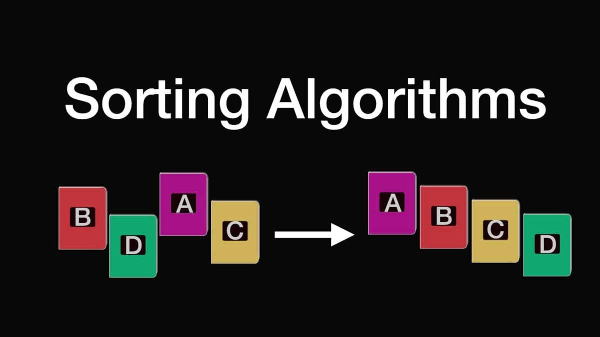
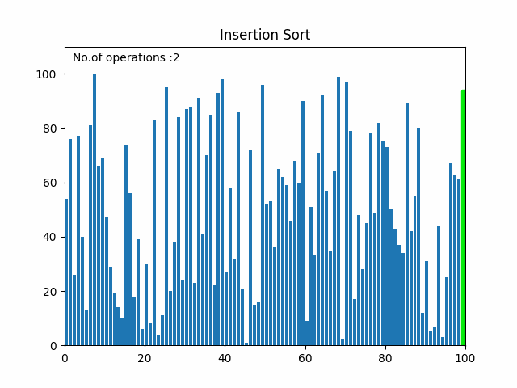
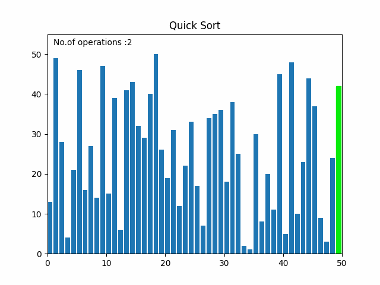
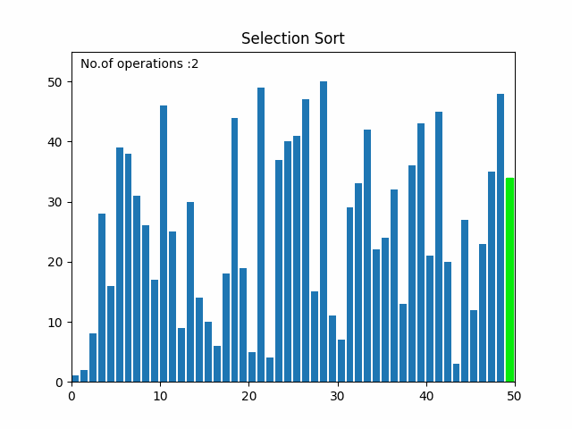

# **[Visualize Sorting Algorithms](https://ductn.info/visualize-sorting-algorithms/)**

## In trô

  Tản mạn một chút sau chuỗi ngày WFH vì con *Cô vi* và đi làm trở lại. Mình nhận
ra trong quá trình làm việc ở nhà mình bị ... **"luời"** đi rất nhiều, cứ thiết nghĩ
WFH thì mình sẽ có nhiều thời gian và làm được nhiều thứ hơn. Nhưng **Khônggg**
cuộc sống không giống như cuộc đời 😢 😢 😢, mình gần như bị cuốn nhiều hơn trong
công việc (không biết có ae nào như mình không ???) một phần do công ty mình đang
nhiều dự án và cũng một phần là mình chán quá :v ... Hôm trước mình có xem lại
một video cũ khá hay ho [Sound of Sorting](https://www.youtube.com/watch?v=kPRA0W1kECg),
ae có thể xem bài viết chi tiết ở [đây](https://panthema.net/2013/sound-of-sorting/).
Và chợt nhận ra lâu rồi mình không làm nhiều về thuật toán, cũng chẳng luyện hackerrank,
leetcode, ... các thứ không "trâu chó" như hồi sinh viên cày để thi ACM 😢. Thế
là mình quyết định "bắt chước" theo cái vid kia để mô phỏng lại mấy thuật toán
sắp xếp :v (đùa chứ code cái merge sort sai lên sai xuống chán vl 😞).

  Ok ... Vẽ thôi !!!

  <p align="center">
    
  </p>

## Thực hành

  Mình có mô phỏng lại 5 thuật toán sắp xếp cơ bản bằng thư viện `matplotlib`
của **python**. Mục đích cũng chỉ là có cái nhìn trực quan hơn về các thuật toán
sắp xếp, cách các thuật toán chạy, và cái nào chạy nhanh hơn :v ... Cái này thì
đã có rất nhiều người làm và còn làm rất đẹp nữa, mình chỉ làm lại để luyện tay
thôi nên nếu có gì chưa được ngon nghẻ lắm thì ae góp ý nhé 😁 😁 😁.
  
  Đây là các thuật toán mình mô phỏng, chắc sẽ update nốt một số thuật toán khác
sau:

- Bubble sort
- Insertion sort
- Quick sort
- Selection sort
- Merge Sort sort
  
  Full source code mình để trên github của mình ở [đây](https://github.com/ductnn/sorting_algorithm)
ae thấy hay thì ủng hộ mình cái ⭐ nhá 😁 Tks ae 😁. Sau đó, mình sử dụng `pyplot`
và `animation` trong thư viện `matplotlib` để mô phỏng lại các thuật toán như sau:

```python
# Initialize fig
fig, ax = plt.subplots(figsize=(16, 8))
ax.set_title(title)

bar_rec = ax.bar(range(len(array)), array, align='edge')

ax.set_xlim(0, n)
ax.set_ylim(0, n * 1.1)

text = ax.text(0.02, 0.95, "", transform = ax.transAxes)

counter = [0]


def update_plot(array, rec, counter):
    for rec, val in zip(rec, array):
        rec.set_height(val)
        rec.set_color("#07eb0b")
    
    rec.set_color("#e80027")

    counter[0] += 1
    text.set_text("No.of operations :{}".format(counter[0]))


anima = anim.FuncAnimation(
    fig,
    func=update_plot,
    fargs=(bar_rec, counter),
    frames=algo,
    interval=1000./60,
    repeat=False
)

plt.show()
```

  Một số hình ảnh mô phỏng các thuật toán:

- Insertion sort

  <p align="center">
    
  </p>

- Quick sort

  <p align="center">
    
  </p>

- Selection sort

  <p align="center">
    
  </p>

  Đó, mình chỉ nghịch vậy thôi 😅 😅 😅, các thuật toán sắp xếp khác mình sẽ tiếp
tục update cho đầy đủ. Và mình sẽ tiếp tục mô phỏng thêm sử dụng `reactjs`, hy
vọng được anh em ủng hộ 😽 😽 😽. 
