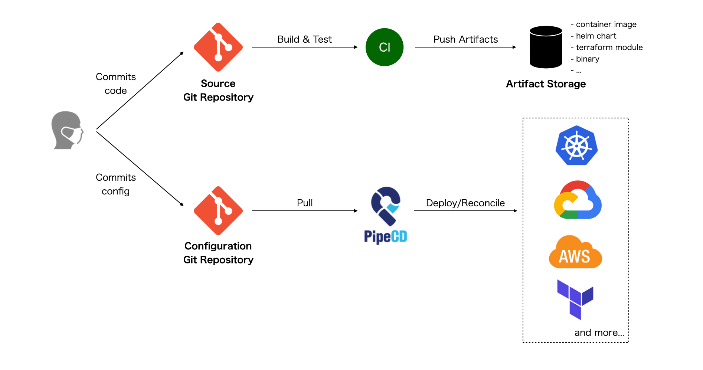
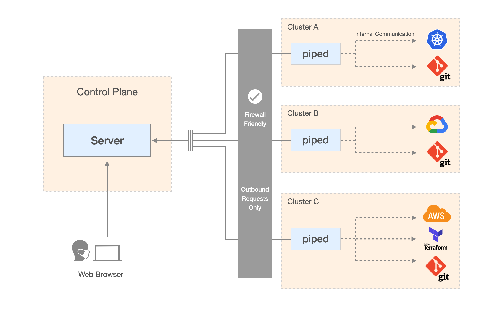
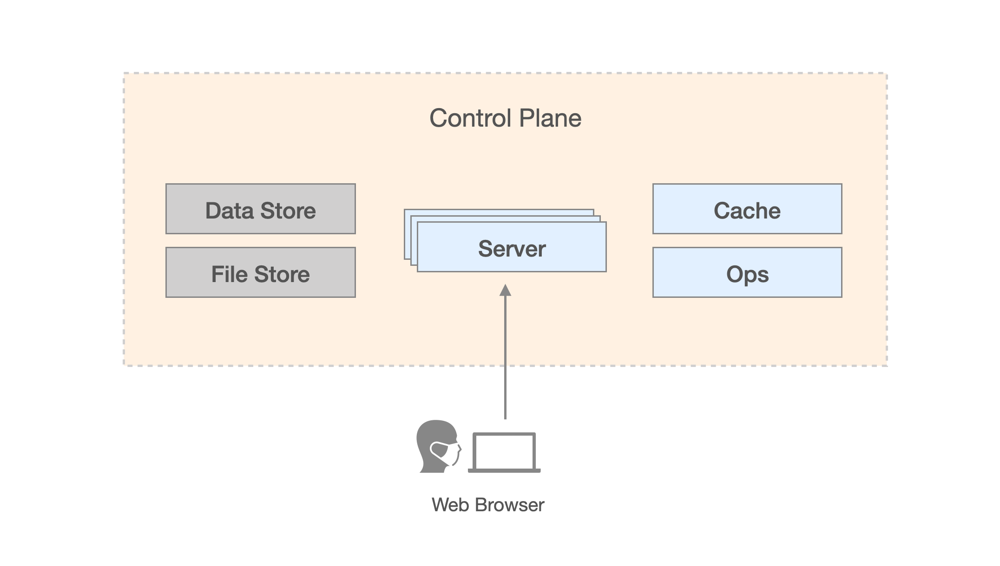
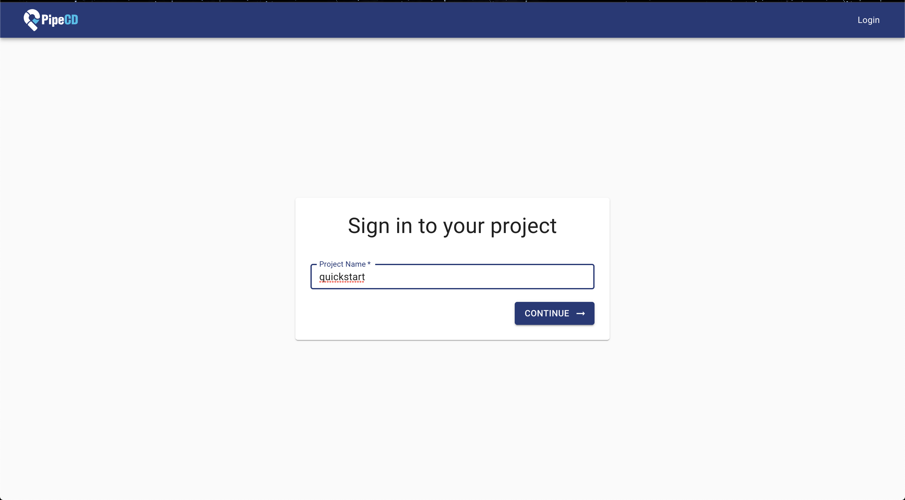
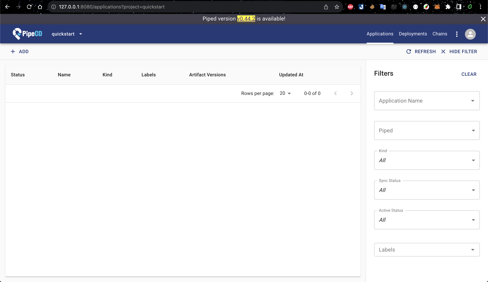
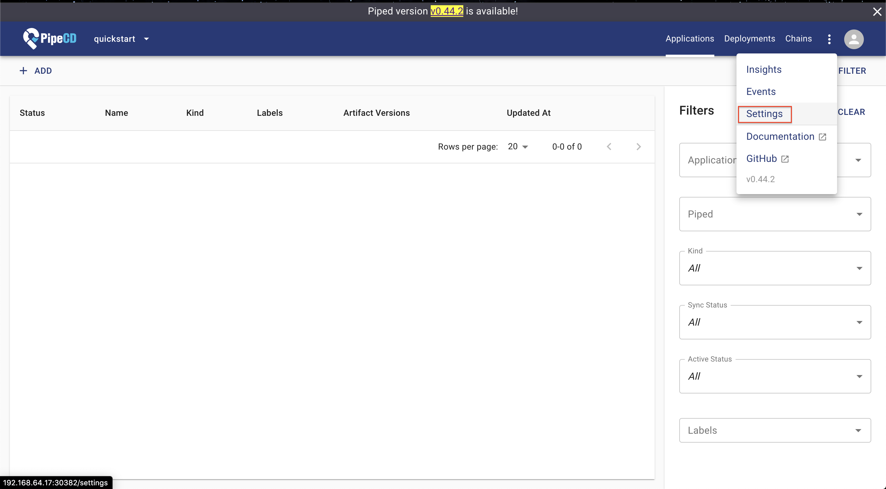
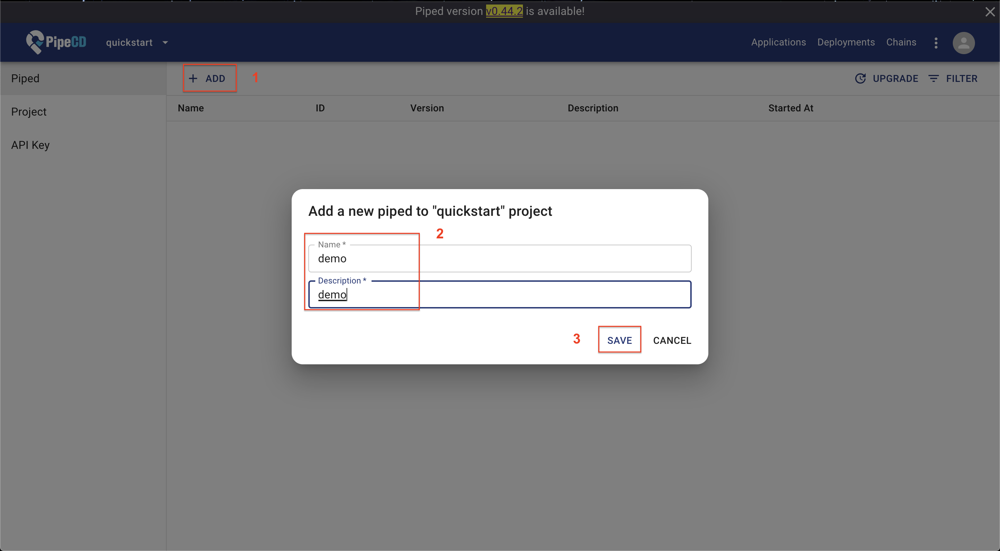
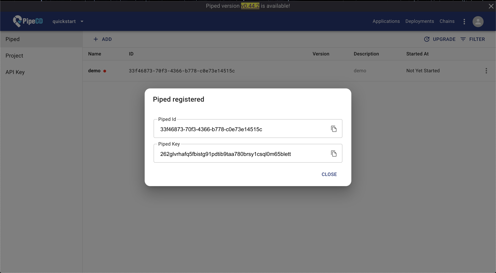
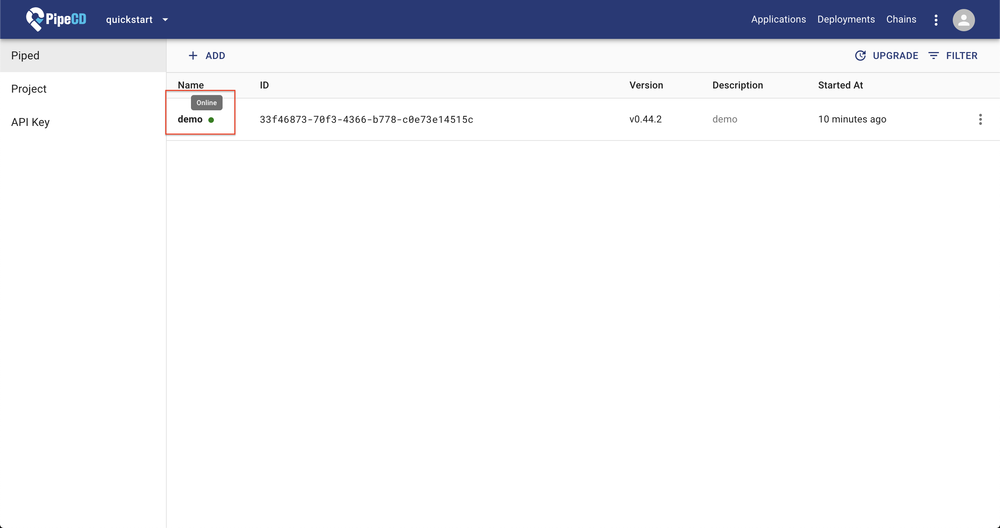

# **[Setup PipeCD](https://ductn.info/setup-pipecd/)**

## Intro
  Hellu anh/em, sau 1 thời gian dài đắm chìm trong ăn chơi, nhảy múa các thứ thì
  hôm nay mình quay trở lại viết lách 1 chút 😷

  Gần đây, mình có tiếp cận được 1 sản phẩm mà mình thấy khá thú vị liên quan
  đến chủ đề về **CI/CD** là **[PipeCD](https://pipecd.dev/)**. Cái tên cũng đã
  nói lên được mục tiêu mà tool này xuất hiện đó là chỉ sử dụng cho **CD** (
  giống như 1 số tool nổi tiếng như ArgoCD, fluxCD, ...). Vậy thì tại sao mình
  lại quan tâm đến tool này 😄? Lý do không nằm ở tính năng mà tool đem lại (à
  thực ra là tính năng xịn đấy nhưng không phải điều mình chú ý :v) mà điều làm
  mình hứng thú là *core maintainers* của **PipeCD** đa phần là người Việt mình và
  **PipeCD** cũng mới được lên sanbox [CNCF](https://www.cncf.io/) vào tháng 5/2023
  rất đáng tự hào 😁😁😁.

  OK!!! Màu mè chút thôi. Trong bài viết này, mình sẽ giới thiệu cho anh/em về
  **PipeCD** và hướng dẫn anh/em cách cài đặt **PipeCD** 🤘🤘🤘

## **Overview**

  <p align="center">
    
  </p>

  Ở ngay trên trang chủ của **PipeCD** có viết luôn

    **The One CD for All {applications, platforms, operations}**

  WoW, như mình có nói ở trên, **PipeCD** sẽ tập trung vào **CD** flows, chứ
  không thực hiện cả quá trình **CI/CD**. Mình thấy hiện nay cũng có khá
  nhiều sản phẩm về **CD** nổi tiếng và bản thân mình và công ty mình cũng đang
  sử dụng là ArgoCD, fluxCD. Vậy thì thằng **PipeCD** có gì khác so với các tool
  trước? Như mình đã sử dụng và trải nghiệm, thì ArgoCD hay fluxCD hướng đến sử
  dụng CD cho **Kubernetes**, còn PipeCD có hướng tiếp cận có khác là *CD for All*
  và hiện tại PipeCD đã support CD cho 5 platforms: *Kubernetes, GCP Cloud Run,
  AWS Lambda, AWS ECS, Terraform*.

## **Architecture**

  <p align="center">
    
  </p>

  Kiến trúc của **PipeCD** khá giống **Kubernetes**, gồm 2 thành phần chính:
  - **Control Plane:** Đây là thành phần quản lý tập trung và cung cấp gRPC API
  để kết nối các `piped`.
  - **piped:** Là 1 file binary, làm nhiệm vụ deploy các services lên cluster.
  **piped** có thể cài đặt chạy trong cụm **Kubernetes** như 1 pod hoặc deployment.
  Ngoài ra, có thể chạy trực tiếp trên VM hoặc local machine của các bạn.
  
  Okie! Tiếp theo, chúng ta sẽ tiến hành setup **PipeCD**

## **Prerequisites**

- Having a running Kubernetes cluster
- Installed Helm (3.8.0 or later)

## **Installation**

  Đầu tiên, cần start 1 cụm *Kubernetes*, để tiện thì mình sử dụng *minikube*:

```sh
minikube start --nodes 1 -p dev --vm-driver="virtualbox"
```

  Để cài đặt **PipeCD**, chúng ta sẽ sử dụng helm để dựng 2 thành phần chính là
  **Control Plane** và **piped**

### Install Control Plane

  <p align="center">
    
  </p>

  Như hình trên **Control Plane** bao gồm 1 số thành phần chính (Server, Cache
  Ops, Data Store, File Store), anh em có thể tham khảo thêm tại [đây](https://pipecd.dev/docs-v0.44.x/user-guide/managing-controlplane/architecture-overview/)

  Ở đây, mình sử dụng helm để cài đặt **Control Plane**, anh em có thể xem
  chart tại [đây](https://github.com/pipe-cd/pipecd/tree/master/manifests/pipecd).
  Okie, tiếp đó mình sẽ chuẩn bị file `values.yaml` riêng nhằm chỉ setup các thành
  phần chính.
  Anh/em có thể xem full config của control plane ở [đây](https://pipecd.dev/docs-v0.44.x/user-guide/managing-controlplane/configuration-reference/)

```yaml
# values.yaml
quickstart:
  enabled: true

config:
  data: |
    apiVersion: "pipecd.dev/v1beta1"
    kind: ControlPlane
    spec:
      datastore:
        type: MYSQL
        config:
          url: root:test@tcp(pipecd-mysql:3306)
          database: quickstart
      filestore:
        type: MINIO
        config:
          endpoint: http://pipecd-minio:9000
          bucket: quickstart
          accessKeyFile: /etc/pipecd-secret/minio-access-key
          secretKeyFile: /etc/pipecd-secret/minio-secret-key
          autoCreateBucket: true
      projects:
        - id: quickstart
          staticAdmin:
            username: hello-pipecd
            passwordHash: "$2a$10$ye96mUqUqTnjUqgwQJbJzel/LJibRhUnmzyypACkvrTSnQpVFZ7qK" # bcrypt value of "hello-pipecd"

secret:
  encryptionKey:
    data: encryption-key-just-used-for-quickstart
  minioAccessKey:
    data: quickstart-access-key
  minioSecretKey:
    data: quickstart-secret-key

mysql:
  rootPassword: "test"
  database: "quickstart"
```

  Let's gooo 🚴🚴🚴

```sh
# First, create namespace pipecd
kubectl create ns pipecd

# Install control-plane
helm upgrade -i pipecd oci://ghcr.io/pipe-cd/chart/pipecd --version v0.44.2 --values="./values.yaml" -n pipecd
```

  Check result:

```sh
➜  pipecd git:(master) ✗ kubectl get pods -n pipecd
NAME                              READY   STATUS    RESTARTS   AGE
pipecd-cache-6cc858bc44-m94pt     1/1     Running   0          5m11s
pipecd-gateway-85658b4584-dsbww   1/1     Running   0          5m11s
pipecd-minio-7dd5b8b987-rm4dz     1/1     Running   0          5m11s
pipecd-mysql-6bcb86b58-xkn5p      1/1     Running   0          5m11s
pipecd-ops-688bfb5b96-g4ljf       1/1     Running   0          5m11s
pipecd-server-76f74765f5-5llpm    1/1     Running   0          5m11s
```

  Okie, về cơ bản thì chúng ta có thể thấy các thành phần cơ bản của **Control Plane**
  đã lên.
  Tiếp đó, chúng ta sử dụng `kubectl port-forward` để expose service của *pipecd
  server* và access vào web console của pipeCD.

```sh
kubectl port-forward svc/pipecd 8080 -n pipecd
```

  Truy cập [localhost:8080](http://localhost:8080).

  Màn hình login vào *project*, trên file `values.yaml` mình có define project id
  là **quickstart**:

  <p align="center">
    
  </p>

  Sau khi sign in vào project, sẽ ra màn hình login, anh/em sử dụng `user/pass`
  là `hello-pipecd` giống như file config:

  <p align="center">
    
  </p>

  Ten ten, và đây là màn hình web console của pipecd 😁😁😁

  <p align="center">
    
  </p>

### Install piped

  Vậy là, mình đã dựng xong thành phần **Control Plane**. Bây giờ, mình sẽ tiến
  hành cài đặt **piped**.
  Như mình có đề cập ở trên, **piped** có thể cài đặt trong cụm **Kubernetes**,
  do vậy để tiện cho phần demo mình sẽ setup **piped** trong cùng 1 cluster với
  **Control Plane** (trên thực tế bạn sẽ cần cài đặt *piped* trong cluster mà
  bạn muốn triển khai services của mình).
  Cũng giống như **Control Plane**, mình sẽ sử dụng helm để cài đặt, trước đó
  mình sẽ viết 1 file `values.yaml` riêng.

```yaml
# values.yaml
config:
  create: true
  data: |
    apiVersion: pipecd.dev/v1beta1
    kind: Piped
    spec:
      projectID: quickstart
      pipedID: <piped ID>
      pipedKeyData: <bas64 piped key>
      apiAddress: pipecd:8080
```

  Ở trong file `values.yaml` mình cần define 4 phần chính:
  - `projectID`: Chính là `projectID` mà mình đã define ở **Control Plane** là
  **quickstart**
  - `pipedID`: Hmm để giải thích bên dưới nhé :v
  - `pipedKeyData`: ... Cái này cũng thế nhé :v
  - `apiAddress`: Đây là địa chỉ của `pipecd server` của **Control Plane**, vì
  mình đang triển khai **piped** trong cùng 1 cụm với **Control Plane** nên chỉ
  cần khai báo đúng tên service là ok :3

  Okie !!! Vậy còn 2 thằng `pipedID` và `pipedKeyData` lấy đâu ra ???
  2 thằng này là thông tin để "định danh" **piped** của bạn được quản lý tại
  **Control Plane**
  Vì vậy, để sử dụng được **piped**, anh/em truy cập lại pipeCD web console để
  đăng ký thông tin cho **piped** của mình. Sau khi vô web, ở phía trên góc phải
  có biểu tượng 3 dấu chấm vô đó vào chọn setting:

  <p align="center">
    
  </p>

  Sau khi vô setting, anh/em thực hiện như các bước sau:

  <p align="center">
    
  </p>

  Okie, vậy là đã lấy được 2 thông tin là `pipedID` và `pipedKeyData`:

  <p align="center">
    
  </p>

  Sau đấy, chúng ta quay trở lại file `values.yaml` của **piped** để config lại
  thông tin:

```yaml
config:
  create: true
  data: |
    apiVersion: pipecd.dev/v1beta1
    kind: Piped
    spec:
      projectID: quickstart
      pipedID: 33f46873-70f3-4366-b778-c0e73e14515c
      pipedKeyData: MjYyZ2x2cmhhZnE1ZmJpc3RnOTFwZHRpYjl0YWE3ODBicnN5MWNzcWwwbTY1YmxldHQ=
      apiAddress: pipecd:8080
```

  Anh/em lưu ý thằng `pipedKeyData` khi mình config trược tiếp vào file `values.yaml`
  thì chúng ta cần base64 lại, anh/em có thể tham khảo tại [đây](https://pipecd.dev/docs-v0.44.x/user-guide/managing-piped/configuration-reference/)

```sh
➜  demo-pipecd echo -n 262glvrhafq5fbistg91pdtib9taa780brsy1csql0m65blett | base64
MjYyZ2x2cmhhZnE1ZmJpc3RnOTFwZHRpYjl0YWE3ODBicnN5MWNzcWwwbTY1YmxldHQ=
```

  Xong xuôi rồi, cài thôi làooo:

```sh
helm upgrade -i piped oci://ghcr.io/pipe-cd/chart/piped --version v0.44.2 --values="./values.yaml" --set args.insecure=true -n pipecd
```

  Anh/em thấy ở đây mình có truyền thêm 1 arg là `--set args.insecure=true` là
  vì mình đang setup trên local nên không cần xác thực TLS.
  Okie!!! Check result:

```sh
➜  demo-pipecd kubectl get all -n pipecd
NAME                                  READY   STATUS    RESTARTS       AGE
pod/pipecd-cache-6cc858bc44-77t5r     1/1     Running   4 (51m ago)    5d2h
pod/pipecd-gateway-85658b4584-ctrj2   1/1     Running   12 (51m ago)   5d2h
pod/pipecd-minio-7dd5b8b987-h4hqt     1/1     Running   4 (51m ago)    5d2h
pod/pipecd-mysql-6bcb86b58-2xh6p      1/1     Running   4 (51m ago)    5d2h
pod/pipecd-ops-688bfb5b96-c57qc       1/1     Running   18 (50m ago)   5d2h
pod/pipecd-server-76f74765f5-fc7xb    1/1     Running   14 (51m ago)   5d2h
pod/piped-55f885c646-jp5sp            1/1     Running   0              8s
```

  Vậy là pod **piped** của mình đã running, anh/em có thể vô lại web console
  để kiểm tra thông tin:

  <p align="center">
    
  </p>

  Hehe, cái **piped** của mình đã chuyển thanh màu xanh và online rồi :v
  Vậy là xong rồi đó anh/em :v

  Ở bài viết sau, mình sẽ đề mô cách sử dụng **PipeCD** để CD các service lên
  1 vài platform cho anh/em thẩm :v

  Cảm ơn anh em đã đọc. Hy vọng bài viết này sẽ giúp anh em có cái nhìn tổng
  quan cũng như là có thể setup 1 cụm **PipeCD** nhỏ để có thể nghịch ngợm linh
  tinh 😄😄😄.
